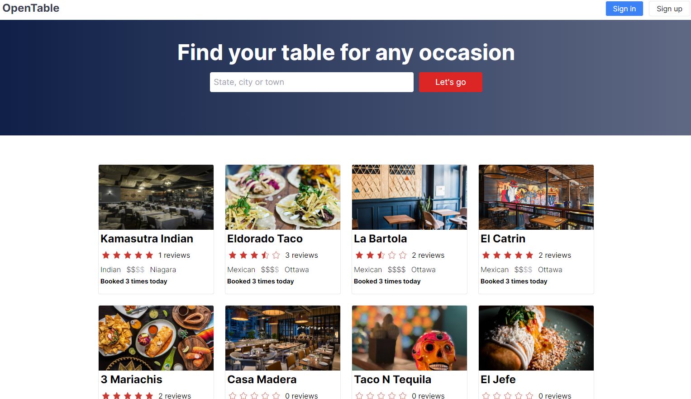
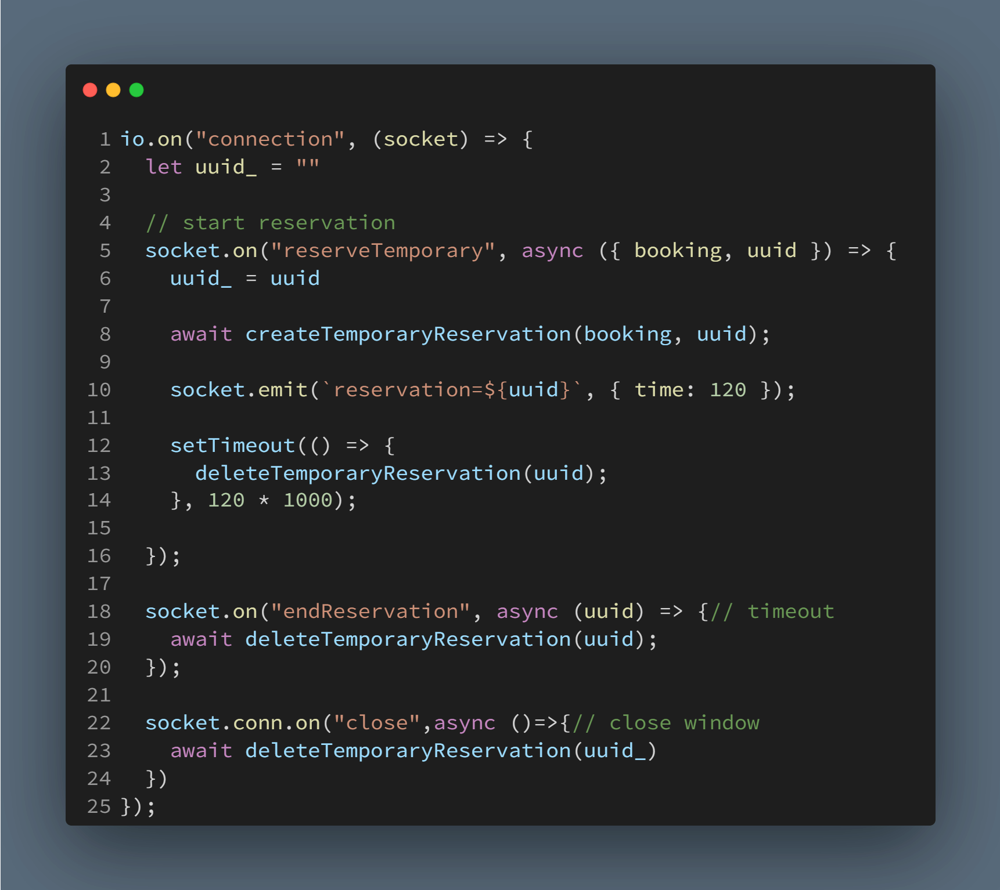

<h1 style='text-align: center;'>OpenTable Clone</h1>

  A project developed to gain hands-on experience in building a booking and availability system.

<h3 style='text-align: center;'>Tech Stack</h3>

  
  
  
  
  
  
  

## Key Features of This Project:

- Advanced Booking & Availability System
- Comprehensive Restaurant Filtering
- Comment and Ranking System
- User Authentication
- Registration Validation

## How the Booking Service Works

1. Choose the number of people and desired reservation time.
2. View available times for the selected criteria near the chosen time.

   

3. Click on your preferred time to temporarily reserve the booking.

   

4. The reservation is held until you close the window or the duration ends.

The system utilizes **Redis** and **WebSocket** for temporary reservations.

5. Other users cannot book the tables at the time you reserved except if the restaurant has any other available tables.

    